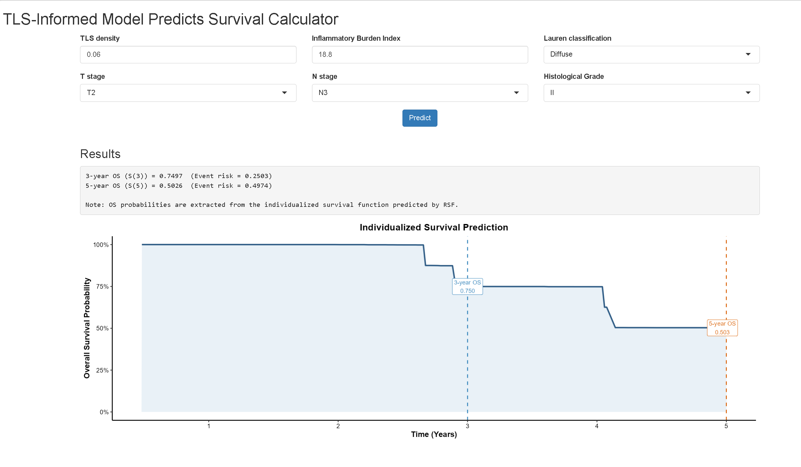

# TLS-Informed Machine Learning Model Predicts Survival and Immune Landscape in Locally Advanced Gastric Cancer
# Dynamic Prediction of Overall Survival

This repository provides the source code for an interactive web-based survival prediction tool developed using the **Shiny framework in R**.  
The application allows clinicians to input patient-specific clinical variables and obtain individualized survival predictions.

## Web Application

The Shiny application can generate:

- Individualized survival curves
- Predicted **3-year overall survival probability**
- Predicted **5-year overall survival probability**

The tool is based on a **Random Survival Forest TLS-Informed-model** constructed from clinical variables.

## Application Interface

<p align="center">

</p>

## How to Run the Application

You can launch the Shiny application directly in **R** using:

```r
shiny::runGitHub("TLS-Informed-Model", 
                 username = "YOUR_GITHUB_USERNAME", 
                 ref = "main")
